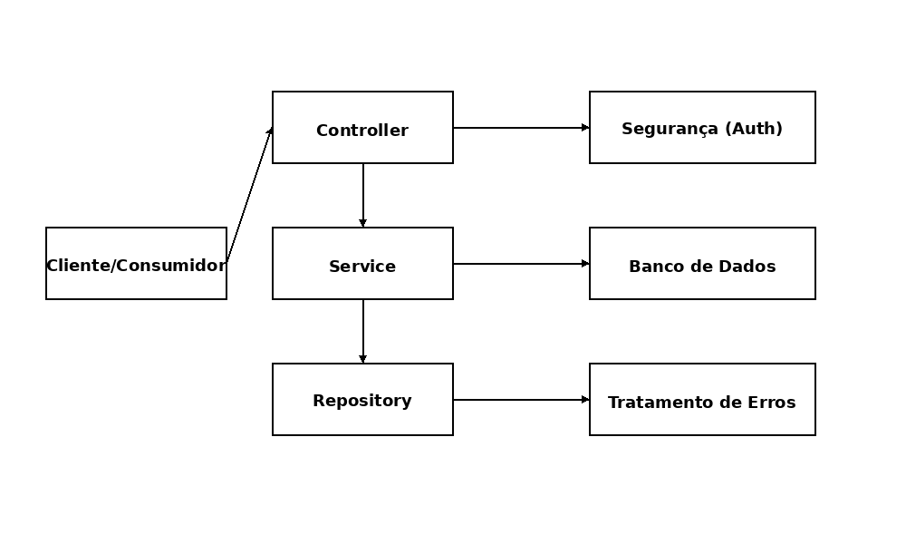

# API de Reservas de Salas

## **Integrantes**

* **Beatriz Silva Pinheiro Rocha - RM553455**
* **Larissa Estella Gonçalves dos Santos - RM552695**
* **Rafael Alves do Nascimento - RM553117**

Este projeto implementa uma API REST para gerenciar reservas de salas corporativas, seguindo os requisitos da disciplina de Arquitetura Orientada a Serviços (SOA). A aplicação foi desenvolvida em Java utilizando o **Spring Boot** com **Maven** e adota práticas recomendadas de arquitetura, tratamento de erros, segurança e documentação.

## Funcionalidades

### Salas

- **Cadastrar sala** (`POST /salas`): cria uma nova sala de reunião.
- **Listar salas** (`GET /salas`): retorna todas as salas cadastradas.
- **Buscar sala por id** (`GET /salas/{id}`): retorna as informações de uma sala específica.

Cada sala possui os campos: `id`, `nome`, `capacidade`, `localizacao` e `status` (ATIVA ou INATIVA).

### Reservas

- **Criar reserva** (`POST /reservas`): agenda uma sala para uma data e horário. Requer autenticação.
- **Listar reservas** (`GET /reservas`): retorna todas as reservas (ativas e canceladas).
- **Buscar reserva por id** (`GET /reservas/{id}`): retorna os detalhes de uma reserva específica.
- **Cancelar reserva** (`PUT /reservas/{id}/cancelar`): cancela uma reserva existente. Reservas canceladas deixam de bloquear o horário. Requer autenticação.

Cada reserva contém: `id`, referência da `sala`, `nomeSolicitante`, `email`, `data`, `horaInicio`, `horaFim`, `finalidade` e `status` (ATIVA ou CANCELADA).

### Regras de Negócio

- Não é permitido criar reservas em salas inativas.
- O horário de término deve ser posterior ao horário de início.
- Reservas ativas não podem se sobrepor no mesmo horário (conflito de agenda).
- Reservas canceladas não bloqueiam horários.
- Operações de criação e cancelamento exigem autenticação via Basic Auth.

## Segurança

Foi implementada autenticação **HTTP Basic** com usuários armazenados em memória. Por padrão, existe um usuário com as seguintes credenciais:

```
usuário: admin
senha:  senha123
```

Apenas as chamadas `POST /reservas` e `PUT /reservas/{id}/cancelar` exigem autenticação. As operações de consulta (`GET`) são públicas.

## Tratamento de Erros

Todas as respostas de erro seguem um formato padronizado contendo:

```json
{
  "timestamp": "2026-03-29T20:00:00",
  "status": 409,
  "error": "Conflict",
  "message": "Já existe reserva para esta sala no horário informado",
  "path": "/reservas"
}
```

São tratados erros de validação (campos obrigatórios), recurso não encontrado, conflito de horário, dados inválidos (ex. horário final menor que inicial) e acesso não autorizado.

## Documentação (OpenAPI / Swagger)

A documentação da API é gerada automaticamente pelo SpringDoc e pode ser acessada após iniciar a aplicação em:

- Swagger UI: [`/swagger-ui.html`](http://localhost:8080/swagger-ui.html)
- JSON OpenAPI: [`/v3/api-docs`](http://localhost:8080/v3/api-docs)

## Banco de Dados (H2)

A aplicação utiliza o banco de dados em memória H2.

O console pode ser acessado em:

- H2 Console: http://localhost:8080/h2-console

Configurações de acesso:
- JDBC URL: jdbc:h2:mem:reservas
- User: sa
- Password: (em branco)

## Diagrama Arquitetural

O diagrama a seguir apresenta uma visão simplificada da arquitetura da solução. O cliente consome a API REST que expõe controladores. Os controladores delegam a lógica de negócio para os serviços, que por sua vez utilizam os repositórios para persistência. A camada de segurança intercepta as chamadas protegidas e o tratamento de erros padroniza as respostas. A persistência utiliza banco em memória H2.



## Como Executar

### Pré‑requisitos

- Java 17 ou superior instalado na máquina.
- Maven 3.8+ instalado. (Caso utilize o wrapper do Maven, basta ter Java instalado.)

### Passos

1. Clone o repositório ou copie o código-fonte.
2. Na raiz do projeto, execute o comando para rodar a aplicação:

   ```bash
   mvn spring-boot:run
   ```

   Também é possível gerar um arquivo jar com `mvn clean package` e executar:

   ```bash
   java -jar target/soa-reservas-spring-1.0-SNAPSHOT.jar
   ```

3. A API estará disponível em `http://localhost:8080`. Utilize um cliente HTTP (como Postman ou cURL) para testar os endpoints.

4. Para autenticar nas operações protegidas, envie as credenciais `admin:senha123` via HTTP Basic. Em cURL, por exemplo:

   ```bash
   curl -u admin:senha123 -X POST http://localhost:8080/reservas \
     -H "Content-Type: application/json" \
     -d '{
       "salaId": 1,
       "nomeSolicitante": "Larissa",
       "email": "larissa@example.com",
       "data": "2026-03-01",
       "horaInicio": "14:00:00",
       "horaFim": "15:00:00",
       "finalidade": "Reunião de Projeto"
     }'
   ```

## Estrutura de Pastas

```
soa-reservas-spring
├── pom.xml                 # arquivo de build Maven com dependências
├── README.md               # este arquivo de instruções
├── diagram.png             # diagrama arquitetural da solução
└── src
    ├── main
    │   ├── java
    │   │   └── com
    │   │       └── example
    │   │           └── reservas
    │   │               ├── ReservationApiApplication.java
    │   │               ├── config        # configuração de segurança
    │   │               ├── controller    # controladores REST
    │   │               ├── dto          # objetos de requisição/resposta
    │   │               ├── entity       # entidades JPA
    │   │               ├── exception    # tratamento de erros
    │   │               ├── repository   # interfaces JPA
    │   │               └── service      # lógica de negócio
    │   └── resources
    │       ├── application.properties   # configuração do banco H2 e Swagger
    └── test
        └── java (vazio)
```
## Considerações Finais

Esta implementação atende aos principais requisitos especificados no enunciado da prova: utilização correta de métodos HTTP, padronização de respostas, tratamento de erros, regras de negócio para reservas e salas, e proteção de operações sensíveis. Além disso, a documentação via Swagger e o diagrama arquitetural facilitam o entendimento e a evolução do projeto.
